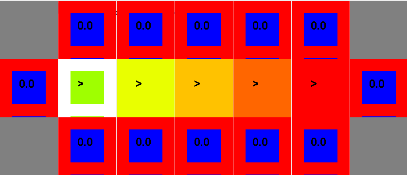
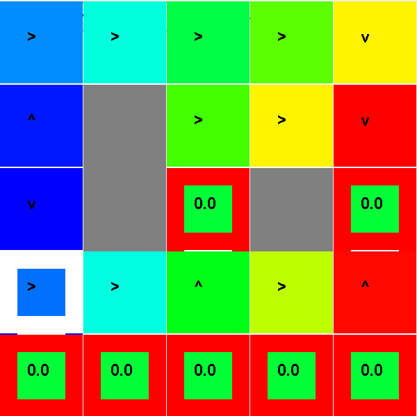
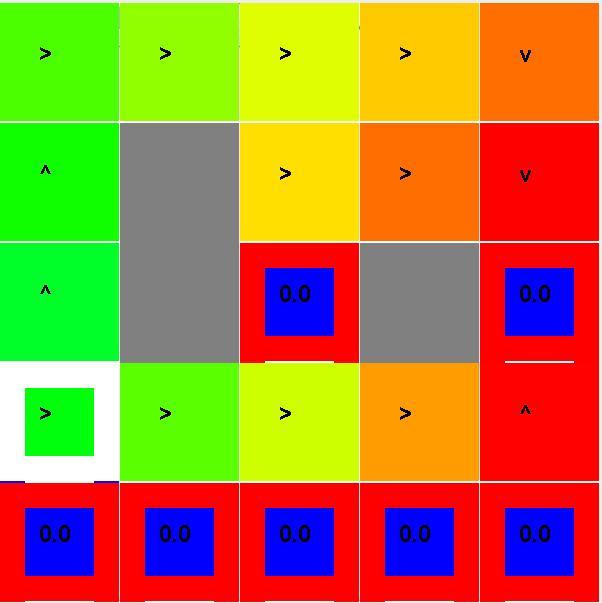
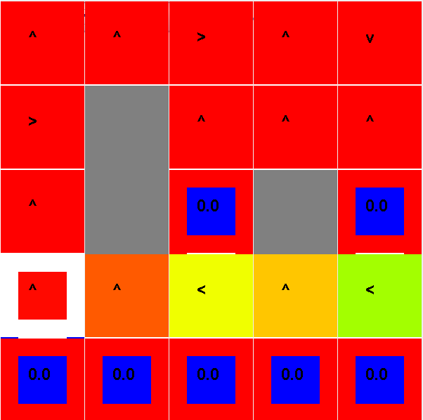

**Nom/Prénom Etudiant 1 :**

**Nom/Prénom Etudiant 2 :**

# Rapport TP1

## Question 5.1 Brigde Grid
*Donnez les valeurs des paramètres et la justification de ces choix*

En plaçant le bruit à 0, l'agent n'a plus aucune chance de tomber dans les -100 absorbants. Il peut donc
traverser avec la politique optimale.

## Question 5.2 Discount Grid
*Donnez les valeurs des paramètres dans chaque cas et la justification de ces choix*

1. $^\gamma=0.9, b=0.05, r_{other}=-2$

Pour atteindre la première récompense, on diminue la récompense de toutes les autres cases pour privilégier la vitesse de convergence. Pour prendre le chemin risqué, on diminue le bruit.

2. $^\gamma=0.9, b=0.05, r_{other}=0$

 Pour prendre le chemin risqué, on diminue le bruit.

3. $^\gamma=0.9, b=0.2, r_{other}=-1$

Pour rester sur le chemin sûr, on laisse le bruit à 0.2. Pour atteindre la première récompense, on diminue la récompense de toutes les autres cases pour privilégier la vitesse de convergence.

4. $^\gamma=0.9, b=0.2, r_{other}=100$

Pour éviter les états absorbants, il suffit que chaque autre case ait une meilleure récompense (ici > 10).

# Rapport TP2

## Question 1:
*Précisez et justifiez les éléments que vous avez utilisés pour la définition d’un état du MDP pour le jeu du Pacman (partie 2.2)*

## Question 2:
*Précisez et justifiez les fonctions caractéristiques que vous avez choisies pour la classe FeatureFunctionPacman (partie 2.3).*