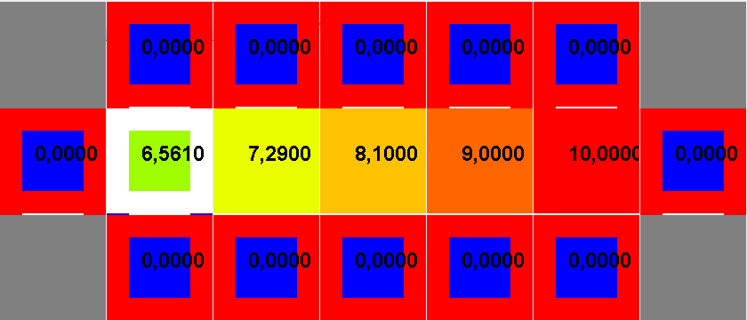
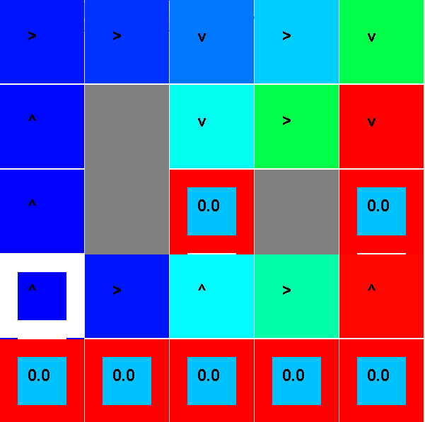

**Nom/Prénom Etudiant 1 :**

**Nom/Prénom Etudiant 2 :**

# Rapport TP1

## Question 5.1 Brigde Grid
*Donnez les valeurs des paramètres et la justification de ces choix*

En plaçant le bruit à 0, l'agent n'a plus aucune chance de tomber dans les -100 absorbants. Il peut donc
traverser avec la politique optimale.

## Question 5.2 Discount Grid
*Donnez les valeurs des paramètres dans chaque cas et la justification de ces choix*

1. $^\gamma=0.9, b=0.05, r_{other}=-2$

Pour atteindre la première récompense, on diminue la récompense de toutes les autres cases pour privilégier la vitesse de convergence. Pour prendre le chemin risqué, on diminue le bruit.

2. $^\gamma=0.9, b=0.05, r_{other}=0$

 Pour prendre le chemin risqué, on diminue le bruit.

3. $^\gamma=0.9, b=0.2, r_{other}=-1$

Pour rester sur le chemin sûr, on laisse le bruit à 0.2. Pour atteindre la première récompense, on diminue la récompense de toutes les autres cases pour privilégier la vitesse de convergence.

4. $^\gamma=0.9, b=0.2, r_{other}=100$

Pour éviter les états absorbants, il suffit que chaque autre case ait une meilleure récompense (ici > 10).

# Rapport TP2

## Question 1:
*Précisez et justifiez les éléments que vous avez utilisés pour la définition d’un état du MDP pour le jeu du Pacman (partie 2.2)*

Nous avons utilisé les éléments suivants :

* **Position X et Y du pacman** pour qu'il puisse différencier deux états identiques après un mouvement
* **Positions X et Y des fantômes** pour qu'il puisse différencier deux états identiques après le mouvement d'un fantôme, et qu'il puisse réagir quand un fantôme approche
* **Nombre de dots restants** pour qu'il ait un suivi de sa progression. 

## Question 2:
*Précisez et justifiez les fonctions caractéristiques que vous avez choisies pour la classe FeatureFunctionPacman (partie 2.3).*

Nous avons utilisé les fonctions caractéristiques suivantes :

* Le biais
* Le nombre de fantômes qui peuvent atteindre le pacman en un pas, afin que celui-ci puisse réagir au danger et changer de direction
* La présence d'un dot dans la position future du pacman pour qu'il privilégie des positions qui le font progresser.
* La distance au plus proche dot pour qu'il puisse avancer vers ses objectifs.

